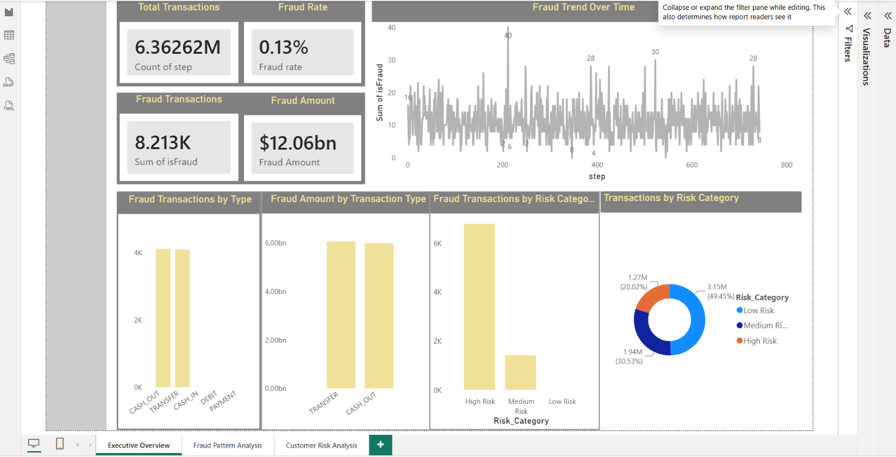
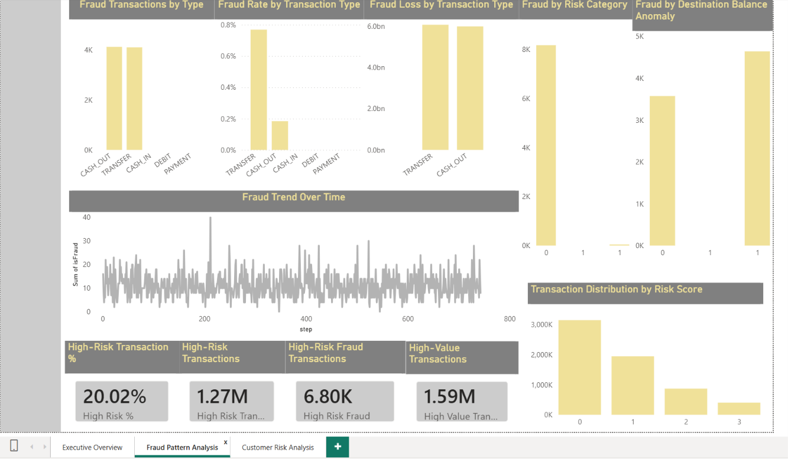
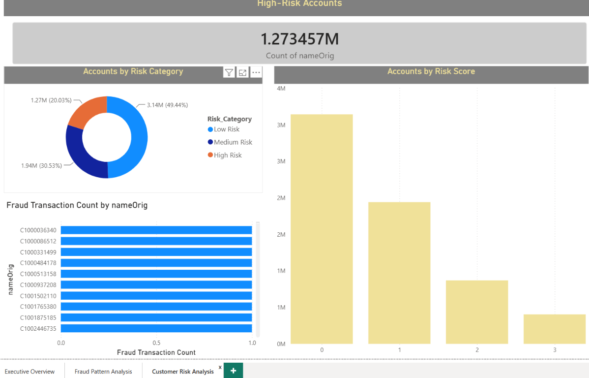

# 🏦 Bank Fraud Detection & Risk Analytics

## 📌 Project Overview

This project analyzes banking transactions to identify fraudulent activities, detect high-risk transactions, and understand fraud patterns using data analytics.

The project follows an end-to-end analytics workflow using SQL, Python, and Power BI.

## 🎯 Business Problem

Banks process millions of transactions, making manual fraud monitoring slow and difficult.

The objective of this project is to:

- Identify fraudulent transactions
- Analyze fraud patterns
- Detect high-risk transactions
- Calculate fraud-related KPIs
- Provide actionable business insights through dashboards

## 🛠️ Tools & Technologies

- SQL / MySQL
- Python
- Pandas
- NumPy
- Matplotlib
- Seaborn
- Power BI
- DAX
- Jupyter Notebook

## 🔄 Project Workflow

SQL → Data Analysis → Python EDA → Feature Engineering → Risk Scoring → Power BI Dashboard → Business Insights

## 🔍 Key Analysis

The project includes:

- Transaction analysis
- Fraud vs genuine transaction analysis
- Fraud amount analysis
- Transaction-type analysis
- Risk scoring
- Risk category classification
- High-value transaction identification
- Balance anomaly detection
- Fraud KPI analysis

## 📊 Power BI Dashboard

The project contains 3 dashboard pages covering fraud overview, fraud patterns, and risk analysis.

### Dashboard Page 1


### Dashboard Page 


### Dashboard Page 3


## 📈 Key Results

- Total Transactions: 6.36 Million
- Fraud Transactions: 8,213
- Fraud Rate: 0.13%
- Total Fraud Amount: ₹12.06 Billion
- High-Risk Transactions: 1.27 Million

## 💡 Business Insights

- Fraud is highly concentrated in specific transaction types.
- High-risk transactions account for a significant portion of identified fraud.
- Risk scoring helps prioritize suspicious transactions for investigation.
- Transaction amount and balance anomalies can be useful indicators of suspicious activity.

## 📁 Project Structure

```text
Bank-Fraud-Detection-Risk-Analytics/
│
├── SQL/
├── Python/
├── PowerBI/
├── screenshots/
└── README.md
